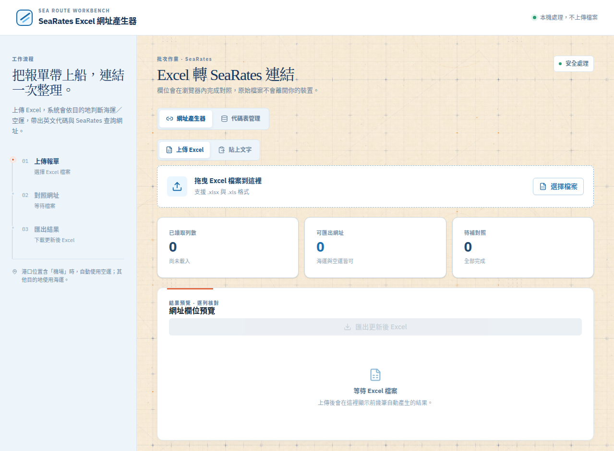

# SeaRates Excel 網址產生器

一個以瀏覽器與 Python／CLI 為核心的 Excel 資料整理工具。它會讀取報單資料，依照港口與機場代碼對照表判斷運輸方式，產生 SeaRates 查詢網址，並可將結果匯出成新的 Excel 檔案。

本專案的主要設計原則是：**資料留在使用者的裝置內處理、代碼表可維護、網址規則透明、輸出結果容易核對**。

## 功能總覽

| 功能 | 說明 |
|---|---|
| 網頁版 Excel 匯入 | 在瀏覽器載入 `.xlsx` 或 `.xls`，不需要上傳到伺服器。 |
| 貼上文字 | 可貼上三欄資料：運輸方式、出發地英文代碼、目的地英文代碼。 |
| 海運／空運判斷 | 依資料與代碼表產生 `Sea`／`Air` 及 `seaport`／`airport` 參數。 |
| SeaRates 網址產生 | 產生包含起點、終點、運輸方式與路由模式的 Distance & Time 查詢網址。 |
| JSON 代碼表管理 | 可在網頁中搜尋、新增、修改、刪除港口／機場資料，並匯出更新後 JSON。 |
| Python 與 CLI | 可在本機以腳本或命令列批次處理 Excel。 |
| Excel 匯出 | 保留原始欄位，並加入運輸方式、英文代碼、SeaRates 查詢連結與處理狀態。 |

## 操作流程


## GitHub 專案 About 與使用說明

GitHub 儲存庫右側的 **About** 區塊已設定以下資訊，訪客可由專案首頁直接進入線上工具或依 Topics 搜尋相關專案：

| About 欄位 | 目前內容 |
|---|---|
| Description | 以 Excel、文字貼上或 Python／CLI 產生 SeaRates 海運與空運距離時間查詢網址的工具，支援 JSON 港口與機場代碼表管理。 |
| Website | <https://qpooqp777.github.io/searates_excel_web/> |
| Topics | `searates`、`excel`、`logistics`、`shipping`、`freight`、`react`、`vite`、`github-pages`、`python` |

訪客建議先從 **Website** 開啟網頁版；若要在本機執行，請依下方安裝說明操作；若要批次處理 Excel，則可使用 `searates_excel_processor.py` 或 `searates_cli.py`。代碼表維護者可以直接查看 `searates_location_codes.json`，或在網頁版的「代碼表管理」分頁編輯後匯出更新檔。

## GitHub Pages 線上版本

本專案已設定 GitHub Actions。每次推送到 `main` 分支後，Actions 會自動安裝依賴、執行 TypeScript 檢查、建置 Vite 靜態檔案，並發布到 GitHub Pages。

線上使用網址：<https://qpooqp777.github.io/searates_excel_web/>

若要在自己的 GitHub 儲存庫啟用相同部署流程，請先到 **Settings → Pages**，將 **Build and deployment → Source** 設為 **GitHub Actions**，再推送一次 `main`。workflow 檔案位於 `.github/workflows/deploy-pages.yml`；Vite 會在 GitHub Actions 環境自動使用 `/searates_excel_web/` 作為專案 base path，因此代碼表 JSON 與單頁路由可在 Pages 子路徑正常工作。

## 網址檢驗與 JSON 修正

若 SeaRates 顯示 **No route found**，可在網頁版的「網址檢驗」分頁使用以下流程：

1. 將顯示錯誤的完整 SeaRates `/distance-time` URL 貼到「錯誤 URL」欄位，按「開啟錯誤 URL」在新分頁確認實際頁面結果。
2. 將可正常顯示路線的完整 URL 貼到「正確 URL」欄位，按「開啟正確 URL」再次確認。
3. 按「分析網址差異」，系統會比較 `from`、`to`、`transportMode`、`routingMode`、`fromPlaceType` 與 `toPlaceType`。
4. 確認差異後按「套用到 JSON」，系統會找出原有地點並更新對應的 `sea` 或 `air` 參數；最後按「匯出修正版 JSON」下載新檔案。

例如 Salalah → Keelung 案例中，`Salalah,+Dhofar,+OM` 會修正為 `Salalah,+Dhofar+Governorate,+OM`。目前的代碼表已同步這項修正。網頁版只能在瀏覽器工作階段中修改資料，若要讓修改永久成為專案預設值，請將匯出的 JSON 覆蓋 `searates_location_codes.json` 與 `client/public/searates_location_codes.json`，再提交到 GitHub。

> 只應將實際確認可用的 URL 套用到代碼表；不同運輸方式或地點類型的參數，必須先確認與正確網址一致。

## 網頁版

網頁版提供兩種輸入方式：

1. **上傳 Excel**：適用於已有完整欄位名稱與多欄報單資料的工作流程。若 Excel 有 `運輸方式` 欄位，系統會以該欄位判斷海運／空運；空白時才依目的地是否含「機場」判斷。出發地與目的地會依 JSON `locations` 查找，海運讀取 `.sea`，空運讀取 `.air`。
2. **貼上文字**：不需要欄位名稱，每一行只需三欄，欄位順序固定為：

   ```text
   運輸方式<TAB>出發地名稱或別名<TAB>目的地名稱或別名
   ```

   出發地與目的地會依 JSON `locations` 的名稱、英文名稱或 `aliases` 查找。海運資料讀取對應地點的 `sea` 欄位，空運資料讀取 `air` 欄位，再組成 SeaRates 查詢網址。

範例：

```text
海運	SALALAH	基隆港
海運	Mundra	基隆港
空運	Soekarno-Hatta	桃園機場
```

也支援逗號分隔，例如 `海運,SALALAH,基隆港`。貼上資料後，按下「讀取貼上資料」，系統會產生 SeaRates 查詢網址並顯示預覽；按「匯出更新後 Excel」即可下載結果。

> 網頁版的資料處理在瀏覽器內完成。使用者可在「代碼表管理」分頁編輯對照資料，修改內容會留在目前瀏覽器工作階段，必須按「匯出 JSON」才會下載成檔案。

### 從 SeaRates 網址自動建立／修正代碼

在「代碼表管理」分頁的「從 SeaRates 網址建立代碼」區塊貼上完整的 SeaRates `/distance-time` 網址，按「分析網址」。系統會解析 `from`、`to`、`transportMode`、`fromPlaceType` 與 `toPlaceType`，並依運輸方式決定要讀取或更新 `sea`／`air` 欄位。

分析結果會顯示每個地點是否已對應到現有 JSON location：

1. 已找到的地點會保留原本的中文名稱，並把 URL 參數更新到對應的 `sea` 或 `air`。
2. 尚未找到的地點會以 URL 的城市名稱建立暫用名稱，並自動加入城市名稱與完整 URL 值作為 aliases。
3. 確認分析結果正確後按「套用到 JSON」，最後按「匯出 JSON」下載更新後的代碼表。
4. 需要確認網址本身時，可按「新分頁開啟」；這不會自動替代 JSON，必須由使用者確認後再套用。

範例網址：

```text
https://www.searates.com/distance-time?from=Salalah,+Dhofar+Governorate,+OM&to=Keelung,+TW&transportMode=Sea&routingMode=short&fromPlaceType=seaport&toPlaceType=seaport
```

這個範例會辨識為海運，將 `Salalah, Dhofar Governorate, OM` 對應至「阿曼 塞拉萊港」的 `sea`，並將 `Keelung, TW` 對應至「基隆港」的 `sea`。空運網址則會依 `airport` 與 `transportMode=Air` 使用 `air` 欄位。



## Excel 輸入欄位

Excel 上傳模式可處理下列報單欄位。原始欄位會保留，程式會在輸出檔加入標準化欄位。

| 欄位 | 用途 |
|---|---|
| 報單號碼 | 保留原始案件識別資訊。 |
| 出口港（裝貨港） | 一般海運資料的出口港名稱。 |
| 出口港位置 | 可作為起點或來源名稱，實際方向請依工作流程確認。 |
| 進口港（卸存地） | 保留原始進口資訊。 |
| 港口位置 | 目的地或卸存地；若包含機場名稱，會依規則使用空運。 |
| 預估運輸距離 | 保留既有距離資料，不由本工具重新計算。 |
| 查詢連結 | 保留原始查詢連結。 |
| 查詢畫面 | 保留原始截圖欄位。 |
| 案件日期 | 保留案件日期。 |
| 運輸項目 | 保留貨物或運輸項目描述。 |
| 總重量 | 保留重量資料。 |

輸出檔案會新增以下欄位：

| 輸出欄位 | 說明 |
|---|---|
| 運輸方式 | `海運` 或 `空運`。 |
| 出發地英文代碼 | 從 JSON 對照表取得的 SeaRates `from` 參數。 |
| 目的地英文代碼 | 從 JSON 對照表取得的 SeaRates `to` 參數。 |
| SeaRates查詢連結 | 產生的完整 SeaRates Distance & Time URL。 |
| 查詢狀態 | `完成` 或顯示待補對照的地點。 |

## JSON 代碼表

`searates_location_codes.json` 是 Python、CLI 與網頁版共用的主要對照資料來源。每個地點可以設定顯示名稱、類型、海運參數、空運參數、別名及代碼。

```json
{
  "schema_version": "1.0",
  "locations": {
    "基隆港": {
      "type": "seaport",
      "sea": "Keelung, TW",
      "aliases": ["Keelung", "KELW"] ,
      "unlocode": "TWKEL"
    }
  }
}
```

欄位規則如下：

| 欄位 | 必要性 | 說明 |
|---|---|---|
| `type` | 建議 | 使用 `seaport` 或 `airport`。 |
| `sea` | 海運必要 | SeaRates 海運的英文 URL 參數。 |
| `air` | 空運必要 | SeaRates 空運的英文 URL 參數。 |
| `aliases` | 建議 | Excel 中可能出現的中文、英文或縮寫名稱。 |
| `unlocode` | 港口建議 | 港口 UN/LOCODE，例如 `TWKEL`。 |
| `iata` | 機場建議 | 機場 IATA 代碼，例如 `TPE`。 |

## Python 版本

Python 版本適合整批處理 Excel。環境需要 Python 3.10 以上，以及 `pandas`、`openpyxl` 和 `xlsxwriter` 等套件。

```bash
pip install pandas openpyxl xlsxwriter
python3 searates_excel_processor.py \
  --input "輸入.xlsx" \
  --output "輸出_SeaRates.xlsx" \
  --codes "searates_location_codes.json"
```

程式會讀取指定輸入檔案，使用 JSON 對照表解析地點，產生海運／空運與 SeaRates URL，最後寫入指定輸出檔案。若 JSON 找不到某個地點，輸出中的「查詢狀態」會標示待補對照，不會默默產生錯誤網址。

## CLI 版本

CLI 版本使用同一套核心處理邏輯，適合整合到批次檔、排程或其他本機工作流程。

```bash
python3 searates_cli.py \
  "輸入.xlsx" \
  --output "輸出_SeaRates.xlsx" \
  --codes "searates_location_codes.json"
```

查看參數說明：

```bash
python3 searates_cli.py --help
```

## SeaRates URL 規則

海運網址使用下列參數：

```text
transportMode=Sea
fromPlaceType=seaport
toPlaceType=seaport
```

空運網址使用下列參數：

```text
transportMode=Air
fromPlaceType=airport
toPlaceType=airport
```

兩種網址都會使用：

```text
routingMode=short
```

本工具只負責產生查詢網址，不會自動繞過 SeaRates 登入、驗證、查詢次數限制或其他網站存取控制。實際距離與航程仍以 SeaRates 開啟網址後顯示的內容為準。

## 專案結構

```text
.
├── client/                         # React 網頁版
├── docs/images/home-preview.png    # README 介面預覽圖
├── searates_location_codes.json    # 港口／機場 JSON 對照表
├── searates_excel_processor.py     # Python 核心處理腳本
├── searates_cli.py                 # CLI 入口
├── SeaRates_Excel_腳本使用說明.md  # 腳本補充說明
└── README.md                       # 本文件
```

## 注意事項

本專案產生的英文地點字串必須符合 SeaRates 當下可識別的地點參數；若 SeaRates 調整地點名稱或查詢頁面規則，應優先更新 JSON 對照表，再重新產生 Excel。對於同一路線的多筆資料，可以共用相同的 SeaRates URL，但每筆案件仍應保留自己的報單號碼與原始欄位。

請避免將含有個人資料、商業機密、完整報單內容或其他敏感資料的 Excel 檔案提交到公開 GitHub 儲存庫。建議使用 `.gitignore` 排除本機輸入檔、輸出檔、截圖與暫存資料。

## 授權與貢獻

本專案目前未指定正式開源授權。若要讓其他人合法重製、修改與散布，請由專案擁有者選擇並加入適合的 LICENSE，例如 MIT License。

歡迎透過 GitHub Issues 提交代碼表修正、網址規則問題或介面改善建議；提交前請先確認沒有包含真實報單資料與敏感資訊。
